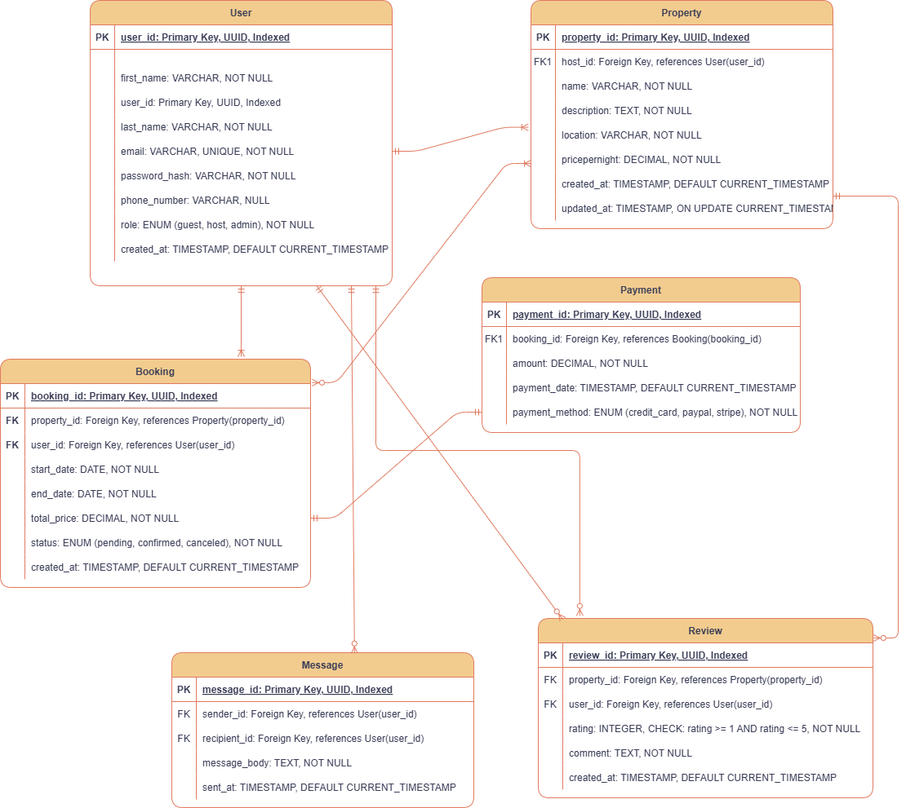

# ER Diagram

Below is the core diagram. It shows the main entities: User, Property, Booking, Payment, Review, Message, and how they tie together.

---

## What’s in This Diagram

1. **User**  
   Captures every person on the platform (guest, host, admin) with contact info and role.

2. **Property**  
   Listings created by hosts, including title, description, location, price, and timestamps.

3. **Booking**  
   Tracks each reservation: which guest, which property, date range, status, and total cost.

4. **Payment**  
   Links to a booking, recording amount, method, and date.

5. **Review**  
   Allows guests to rate and comment on a property after their stay.

6. **Message**  
   Enables direct messaging between any two users.

---

## Key Relationships

- A **host** (User) can list many **properties**.  
- A **guest** (User) can make many **bookings**, and each **property** can have many **bookings**.  
- Each **booking** can have one or more **payments**.  
- Guests write **reviews** for properties they stay in, and properties receive many reviews.  
- Users send and receive **messages** to stay in touch.

---
